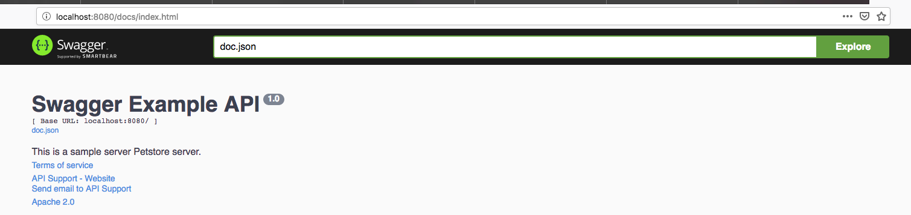
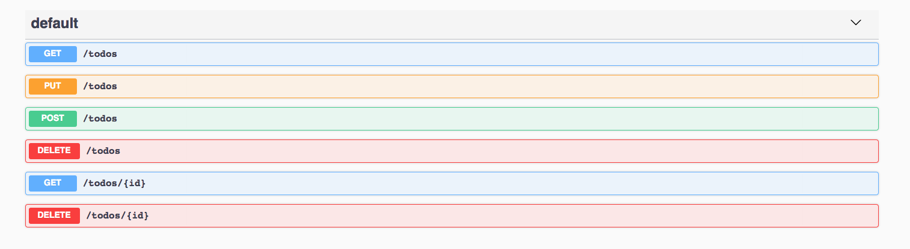
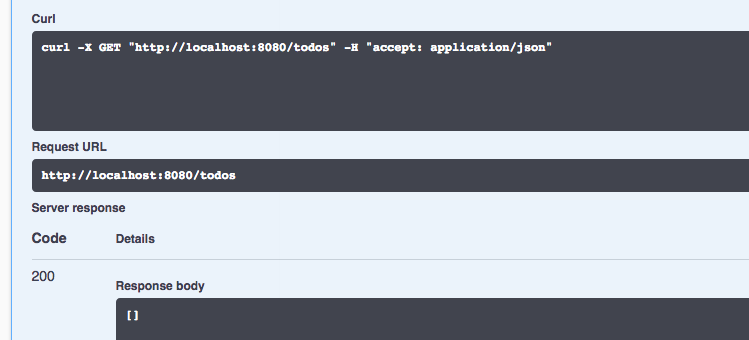
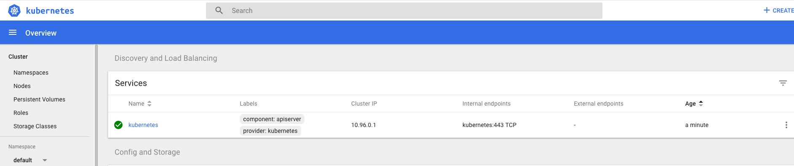
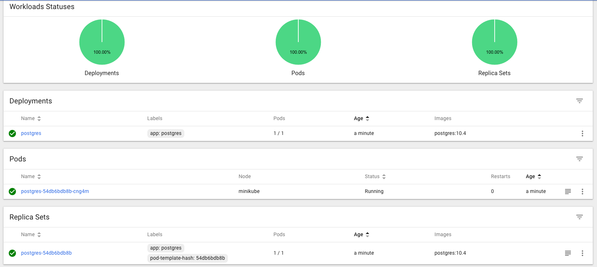

# Introduction

Scope of this software is just to play around with Kubernetes (Minikube). </br>
This software is exposing a set of rest-api to manage a collection of ToDo operations and is accessing postgres to store and read Todos. </br>
We will see how this app can be deployed locally, using just Docker containers to link one container to another or using kubernetes, minikube in this case. </br>
In the past I also used this app using mysql: </br>
https://github.com/DanielePalaia/web-service-kubernetes</br>

## Datastore and rest api

The todos operations are saved in a mysql datastore defined in datastore.sql

```
CREATE TABLE ToDo (
	    ID serial,
	    Topic varchar(255),
	    Completed int,
	    Due varchar(255) DEFAULT '',
	    PRIMARY KEY (ID)
);
```

The software exposes these rest api (GET, POST, PUT, DELETE) which can be tested with curl.</br>
Use GET to get all todo items inside the collection </br>
Use PUT to create a new item for the Todo Collection </br>
Use POST for update and DELETE for deletion </br>

```
curl http://localhost:8080/todos
curl -H "Content-Type: application/json" -d '{"Topic":"New TodoElem", "Completed":0}' -X PUT http://localhost:8080/todos
curl http://localhost:8080/todos/1
curl -H "Content-Type: application/json" -d '{"Id":0,"name":"New TodoElem Updated"}' -X POST http://localhost:8080/todos
curl -X DELETE http://localhost/todos/1
curl -X DELETE http://localhost/todos
```

A Swagger documentation that allows you to test this interface is also provided:




## Running the app locally
In conf file please specify the right database connection information,
then you can simply run the binary provided in ./bin and run the binary </br>

**./kubernetes-postgres**</br></br>
Then go to the swagger interface</br>
http://localhost:8080/docs/index.html</br>
 </br>
Initially you will receive an empty list of todos. Fill the todo with the other rest api with curl or the swagger doc.
</br>

## Running on kubernetes/minikube

### 1. Install minikube
On mac is enough to:</br>
**brew cask install virtualbox**</br>
**brew cask install kubectl**</br>
**brew cask install docker** </br>

### 2. Start minikube and dashboard
Start minikube: </br>
**minikube start** </br>
Run dashboard </br>
**minikube dashboard**</br>

 </br>

### 3. Install Postgresql on minikube 
Follow this guideline to create a volume a pod and a service: </br>
https://severalnines.com/blog/using-kubernetes-deploy-postgresql
</br>
yaml file have been provided in kub-yaml folder. You can just: </br>
**kubectl create -f postgres-configmap.yaml** </br>
**kubectl create -f postgres-storage.yaml** </br>
**kubectl create -f postgres-deployment.yaml** </br>
to create a configmap, a storage a pod and a deployment for postgresql. 

 </br>

### 4. Configuring postgresql on minikube and creating database and table
You need to create database and table in the postgres instance in your minikube env </br>
you can use this command to access the pod </br>
kubectl exec -it <podname> bash </br>
then swith to user postgres and do psql </br>
Create same database and table as for datastore.sql </br>

### 5. Deploy this service kubernetes-postgres on minikube and link to the postgres instance
A version of the microservice has already been deployed on dockerhub: </br></br> 
https://cloud.docker.com/u/danielepalaia/repository/docker/danielepalaia/kubernetes-postgres </br></br>

Also a Dockerfile is provided. You may want to create an image you need to: </br>
**docker build -t kubernetes-postgres .** </br>
```
Danieles-MBP:kubernetes-postgres dpalaia$ docker build -t kubernetes-postgres  .
Sending build context to Docker daemon  40.18MB
Step 1/10 : FROM golang
 ---> be63d15101cb
Step 2/10 : ADD . /go/src/kubernetes-postgres
 ---> 0effa7f0cd0f
Step 3/10 : RUN go get github.com/gorilla/mux
 ---> Running in a869896a9863
Removing intermediate container a869896a9863
 ---> 119d271a84c0
Step 4/10 : RUN go get github.com/lib/pq
 ---> Running in 3d80920c4029
Removing intermediate container 3d80920c4029
 ---> ce05cab4fafa
Step 5/10 : RUN go get github.com/swaggo/http-swagger
 ---> Running in 21f1a722790f
Removing intermediate container 21f1a722790f
 ---> dcb30e1aee12
Step 6/10 : RUN go get github.com/alecthomas/template
 ---> Running in c3867ea3a849
Removing intermediate container c3867ea3a849
 ---> cc5731748581
Step 7/10 : ADD conf /go
 ---> 7ffe14d67cfd
Step 8/10 : RUN go build /go/src/kubernetes-postgres
 ---> Running in c5d6d3be35cf
Removing intermediate container c5d6d3be35cf
 ---> 3bc4c6d70443
Step 9/10 : ENTRYPOINT /go/src/kubernetes-postgres/kubernetes-postgres
 ---> Running in 68f435ac926b
Removing intermediate container 68f435ac926b
 ---> 207c2512b411
Step 10/10 : EXPOSE 8080
 ---> Running in faafd404a00b
Removing intermediate container faafd404a00b
 ---> 254945f7ff05
Successfully built 254945f7ff05
Successfully tagged kubernetes-postgres:latest
```

then </br>
**docker run --publish 6060:8080 --name test kubernetes-postgres** </br>
**docker push** </br>
if you wanto to push back to DockerHub. </br>
You many need to modify your conf file to database connection if different from standard values. In the image pushed on dockerhub these values are set: </br>
``
USERNAME:postgres
PASSWD:
HOST:postgres
DATABASE:tododatastore
PORT:5432
``

### 5. Deploy the pod on minikube
